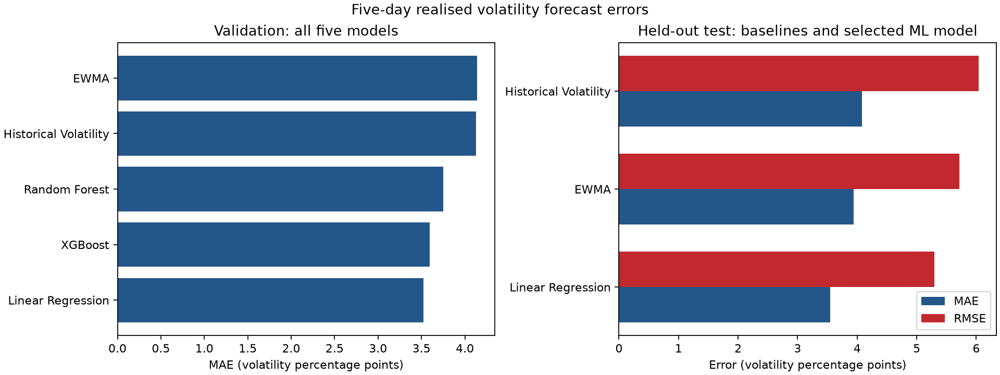

# ML-Driven Portfolio Risk Analytics

## Research question

Can simple machine-learning models improve forecasts of an equal-weight ETF portfolio's
next-five-trading-day realised volatility? Do those forecasts produce well-calibrated
five-day Value at Risk (VaR) limits on a held-out test period?

**Models:** Historical Volatility, EWMA, Linear Regression, Random Forest and XGBoost.

**Main result:** Linear Regression was selected on validation and recorded test MAE
**0.035502** and RMSE **0.052967**, the lowest errors
among the three final test models.


## Data and portfolio

The project uses Yahoo Finance adjusted close prices for seven ETFs on the XNYS calendar.
The fixed sample contains **4,201 price dates** from
**2010-01-04 to 2026-09-16** and
**4,200 daily return dates**. Part 1 found no missing expected
sessions or cross-asset price gaps. Raw and observation-level data remain local because
market-data redistribution rights are separate from the yfinance software license; see
[data provenance](data/README.md).

| ETF | Main exposure |
| --- | --- |
| SPY | US large-cap equities |
| QQQ | Nasdaq-100 equities |
| IWM | US small-cap equities |
| TLT | Long-duration US Treasury bonds |
| HYG | High-yield corporate bonds |
| GLD | Gold |
| DBC | Broad commodities |

The portfolio keeps a constant **1/7 weight** in each ETF. Its daily return is the mean of
the seven ETF returns, so portfolio volatility includes cross-asset co-movement.

## Features and target

Part 2 creates eight backward-looking features: `return_1d`, `return_5d`, `return_20d`, `volatility_5d`, `volatility_20d`, `volatility_60d`, `drawdown`, `average_correlation_20d`. The target at date `t` is
the annualised sample standard deviation of portfolio returns from `t+1` through `t+5`.
The final modeling data contain **4,136 rows** from
**2010-03-31 to 2026-09-09**, with no missing or non-finite
values. No future information enters the features. Independent formulas, full target
alignment and prefix-invariance checks passed.

## Forecasting models and time split

The two baselines are trailing 20-day Historical Volatility and EWMA with lambda 0.94.
The ML models are Linear Regression, Random Forest and XGBoost. Validation MAE is the
primary selection metric and RMSE is secondary. The chronological split is never shuffled;
five boundary observations are purged before validation and test so target windows do not
cross split boundaries. Scaling and model fitting use only eligible earlier observations.

| Split | Dates | Rows |
| --- | --- | --- |
| train | 2010-03-31 to 2017-12-21 | 1948 |
| validation | 2018-01-02 to 2021-12-23 | 1003 |
| test | 2022-01-03 to 2026-09-09 | 1175 |

## Forecast results

Errors are annualised volatility decimals. Random Forest and XGBoost were not evaluated on
test because the test set was not used for model selection.

| Model | Validation MAE | Validation RMSE | Test MAE | Test RMSE |
| --- | --- | --- | --- | --- |
| Linear Regression | 0.035246 | 0.056723 | 0.035502 | 0.052967 |
| XGBoost | 0.035950 | 0.061745 | Not evaluated | Not evaluated |
| Random Forest | 0.037528 | 0.064782 | Not evaluated | Not evaluated |
| Historical Volatility | 0.041307 | 0.063688 | 0.040831 | 0.060382 |
| EWMA | 0.041399 | 0.061941 | 0.039416 | 0.057162 |

**Linear Regression** was selected on validation. Its test RMSE was
**7.34% lower** than
EWMA, the lower-RMSE baseline. This point comparison does not establish
statistical superiority or trading profitability.



## Five-day VaR backtesting

Part 4 uses the saved annualised test volatility forecasts and zero expected return:

```text
sigma_5d = sigma_annual * sqrt(5 / 252)
VaR_loss(95%) = 1.645 * sigma_5d
VaR_loss(99%) = 2.326 * sigma_5d
violation = actual future 5-day compounded return < -VaR_loss
```

Actual outcomes compound the five portfolio returns after each forecast date. Formal
Kupiec unconditional coverage tests use every fifth forecast from the first test date,
giving **235 non-overlapping windows** per model and confidence level.

| Model | Confidence | Windows | Violations | Rate | Expected | Kupiec LR | p-value |
| --- | --- | --- | --- | --- | --- | --- | --- |
| Historical Volatility | 95.00% | 235 | 10 | 4.26% | 5.00% | 0.2883 | 0.5913 |
| Historical Volatility | 99.00% | 235 | 3 | 1.28% | 1.00% | 0.1670 | 0.6828 |
| EWMA | 95.00% | 235 | 8 | 3.40% | 5.00% | 1.4121 | 0.2347 |
| EWMA | 99.00% | 235 | 1 | 0.43% | 1.00% | 0.9990 | 0.3176 |
| Linear Regression | 95.00% | 235 | 15 | 6.38% | 5.00% | 0.8735 | 0.3500 |
| Linear Regression | 99.00% | 235 | 4 | 1.70% | 1.00% | 0.9668 | 0.3255 |

None of the six Kupiec tests rejects the expected violation rate at 5%. This does not prove
correct calibration: only 2.35 violations are expected at 99%, and the test checks frequency
rather than independence. Linear Regression has the lowest test forecast error but the
highest observed VaR violation rate, so point accuracy and tail calibration differ.


## Findings

- Linear Regression had the lowest validation MAE and the lowest test MAE and RMSE.
- Both tree models ranked behind Linear Regression on the fixed validation period.
- All six non-overlapping Kupiec p-values exceeded 0.05, with limited power at 99%.
- Lower volatility forecast error did not imply fewer VaR violations.

## Limitations

- Five daily returns make the realised-volatility target noisy.
- One chronological split and one test period cannot establish a stable model ranking.
- Normal VaR, zero expected return and square-root-of-time scaling are restrictive.
- The Kupiec test checks unconditional frequency; 235 windows give little 99% tail evidence.
- Daily rebalancing ignores costs and liquidity, and seven ETFs limit generalisation.

## Project structure

```text
scripts/       # Five complete analysis stages
notebooks/     # Matching notebooks with saved execution output
src/           # Small execution and validation helpers
tests/         # Formula, leakage, alignment and saved-result checks
data/          # Provenance note; raw and processed observations stay local
outputs/       # Public aggregate tables and figures; detailed rows stay local
```

## Reproduce the analysis

The project was tested with Python 3.14. In a virtual environment, run from the project root:

```bash
python -m pip install -r requirements.txt
python src/run_pipeline.py
python src/update_readme.py
python -m unittest discover -s tests -v
python src/verify_pipeline.py
```

The first run needs network access if no local raw snapshot exists. A fresh Yahoo download
may include provider revisions, so exact published numbers require the recorded local data
vintage.

The five scripts are the authoritative implementation. `src/run_pipeline.py` runs all five
scripts and all five notebooks, preserves notebook output, and checks that both paths save
byte-identical CSV files. Aggregate results are under `outputs/tables`; core figures are
under `outputs/figures`.

## References

- [yfinance documentation and data-use note](https://github.com/ranaroussi/yfinance#readme)
- [RiskMetrics Technical Document (1996)](https://www.msci.com/www/research-report/1996-riskmetrics-technical/018482266)
- [Kupiec proportion-of-failures test](https://www.mathworks.com/help/risk/risk.validation.proportionoffailurestest.html)
