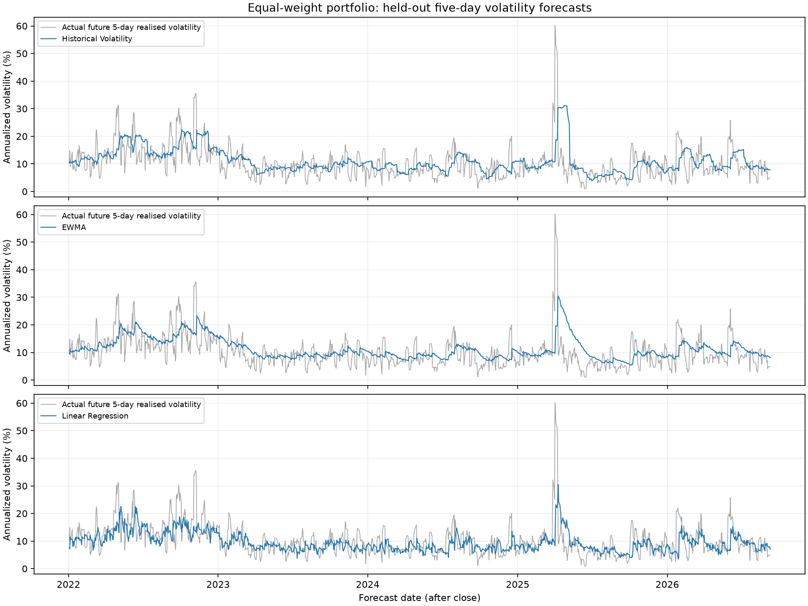
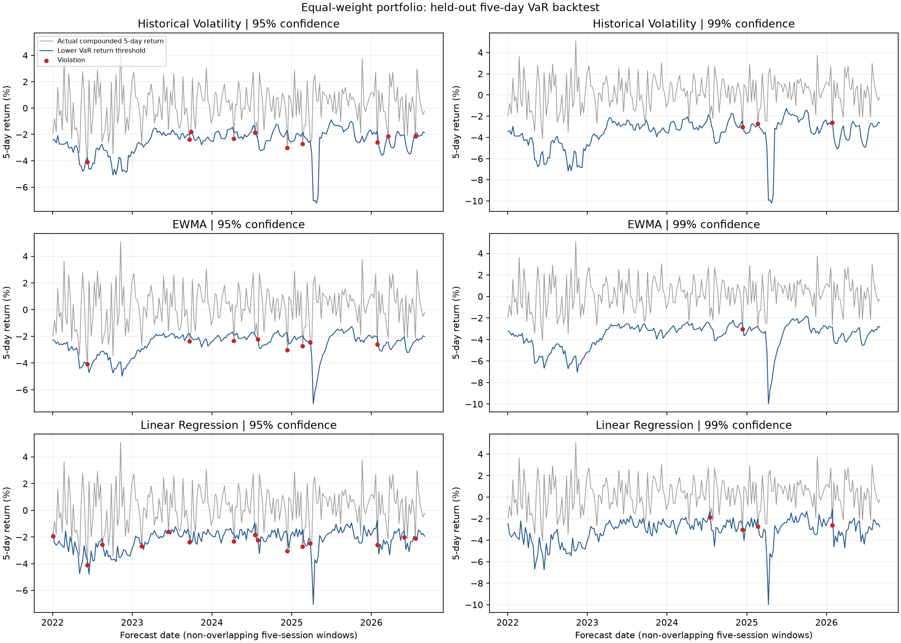

# ML-Driven Portfolio Risk Analytics

## Overview and research question

Can machine learning improve forecasts of an equal-weight ETF portfolio's next-five-day
realised volatility, and do those forecasts produce well-calibrated five-day risk limits?
This project compares transparent baselines with three supervised models, then evaluates
95% and 99% Value at Risk (VaR) using held-out portfolio returns. It is an empirical risk
analysis, not a trading system or evidence of investment profitability.

## Data and the seven ETFs

| ETF | Exposure |
| --- | --- |
| SPY | US large-cap equities |
| QQQ | Nasdaq-100 equities |
| IWM | US small-cap equities |
| TLT | Long-duration US Treasury bonds |
| HYG | High-yield corporate bonds |
| GLD | Gold |
| DBC | Broad commodities |

Yahoo Finance adjusted close prices are obtained through yfinance. The fixed inclusive
cutoff is **2026-09-16**. The retained vintage contains **4,201 price dates** from
2010-01-04, and **4,200 daily return dates** from 2010-01-05, for all seven assets.
Prices account for provider adjustments such as splits and distributions.

The portfolio is rebalanced daily to 1/7 per ETF, so each daily portfolio return is the
mean of the seven asset returns. Portfolio volatility is calculated from this return
series and includes the effect of cross-asset co-movement; it is not average asset volatility.
Transaction costs, spreads, taxes and liquidity constraints are omitted.

Raw and observation-level datasets remain local. The repository contains research
summaries, charts and a download workflow, not a redistributed market-data database.
See [data provenance and usage](data/README.md). Exact reproduction requires the same
raw snapshot and package versions; a fresh download may reflect historical revisions.
The recorded reference hashes are in [tests/reference_snapshot.json](tests/reference_snapshot.json).

## Project structure

```text
scripts/
    part_01_data_preparation.py
    part_02_feature_engineering.py
    part_03_volatility_forecasting.py
    part_04_var_backtesting.py
    part_05_results_and_figures.py
notebooks/
    01_data_preparation.ipynb
    02_feature_engineering.ipynb
    03_volatility_forecasting.ipynb
    04_var_backtesting.ipynb
    05_results_and_discussion.ipynb
src/               # Execution, notebook synchronization and verification helpers
tests/             # Independent formula and saved-result checks
data/raw/          # Local downloaded snapshot and provenance metadata
data/processed/    # Local prices, returns, ETF and portfolio modeling datasets
outputs/tables/    # Aggregate reports; detailed forecasts also saved locally
outputs/figures/   # Four published research figures
outputs/models/    # Local fitted model, reproducible from Part 3
```

The five scripts contain the full stage code. Their `# %%` sections are copied into
the corresponding notebooks by `src/sync_notebooks.py`; the notebooks contain actual
executed code, explanations, tables and figures. Edit a script and resynchronize instead
of maintaining separate formulas. Earlier project files are retained in ignored local
backups. No Git history was replaced.

## Data preparation and feature engineering

Part 1 loads or downloads seven ETFs and checks that every expected XNYS trading session
has a positive, finite Adj Close for each asset. Missing dates or prices stop execution;
no prices are filled and no trading dates are dropped. The calendar includes holidays,
special closures and early-close sessions. Existing ordinary OHLCV fields receive basic
consistency checks, without comparing their ranges to Adj Close. The start date and cutoff
are project choices.
Returns use Adj Close to account for provider split and distribution adjustments:
`return[t] = price[t] / price[t-1] - 1`. Only the first undefined return is removed;
zero and negative returns are valid. Prices and returns are saved as separate CSVs.
A compact quality report records dimensions, date ranges and hashes used by later stages.
The raw snapshot is hash-checked and never overwritten. The notebook follows the script;
shared checks live in `src/data_preparation_checks.py`.

Part 2 preserves ten features: 1/5/20-day returns, 5/20/60-day historical sample volatility,
expanding-peak drawdown, trailing 20-day correlation to SPY, and 60/120-day momentum.
All volatility uses `ddof=1` and annualization by `sqrt(252)`. The target on date t is
`std(r[t+1], ..., r[t+5], ddof=1) * sqrt(252)`. It excludes the return on t.
Features are available after the close of t. The initial 120-date warm-up and final
five-date target tail are removed, with NaNs reported before removal.

The original ETF dataset remains **28,532 rows x 13 columns**, **2010-06-25 to 2026-09-09**:
Date, asset, ten features and one target. Part 3 separately constructs **4,076 portfolio
rows** on the same dates with the same feature/target conventions. Target start/end dates
are audit fields and are never predictors.

## Volatility forecasting

- **Historical Volatility:** trailing 20-day sample standard deviation, annualized.
- **EWMA:** `v[t] = 0.94*v[t-1] + 0.06*r[t]^2`, initialized with the first squared return;
  forecast `sqrt(252*v[t])` after observing t. This is a zero-mean second-moment baseline.
- **Linear Regression:** standardized features followed by an ordinary linear fit.
- **Random Forest:** 200 trees, depth 3 or 6, minimum leaf size 10.
- **XGBoost:** 200 trees, depth 2 or 3, learning rate 0.03, row subsampling 0.8.

Tree candidates and random seed 42 are fixed in the code. A fixed floor of 1e-8 enforces
nonnegative forecasts. Validation **RMSE** is the primary selection metric; MAE is also
reported. RMSE weights large misses more heavily. No test-driven tuning is performed.

| Split | Rows | First forecast | Last forecast | Last outcome date |
| --- | --- | --- | --- | --- |
| train | 1888 | 2010-06-25 | 2017-12-21 | 2017-12-29 |
| validation | 1003 | 2018-01-02 | 2021-12-23 | 2021-12-31 |
| test | 1175 | 2022-01-03 | 2026-09-09 | 2026-09-16 |

Ten boundary rows are purged: no training target reaches validation and no validation
target reaches test. This is one chronological holdout, not k-fold cross-validation.
Scalers fit only on the corresponding fitting sample. After validation selection, the
chosen ML specification is refitted once on all eligible pre-2022 labels and frozen.
Only the chosen ML model and the two baselines are evaluated on test. Daily baseline
updates use newly observed past returns and require no future outcomes.

## Results

All errors below are annualized volatility decimals (0.01 means one volatility percentage
point). Unselected ML models are deliberately not scored on test.

| Model | Validation MAE | Validation RMSE | Test MAE | Test RMSE |
| --- | --- | --- | --- | --- |
| Linear Regression | 0.035279 | 0.057393 | 0.036341 | 0.052714 |
| XGBoost | 0.035301 | 0.060218 | Not evaluated | Not evaluated |
| EWMA | 0.041399 | 0.061941 | 0.039416 | 0.057162 |
| Random Forest | 0.036301 | 0.063280 | Not evaluated | Not evaluated |
| Historical Volatility | 0.041307 | 0.063688 | 0.040831 | 0.060382 |

**Linear Regression** was selected on validation. Its test RMSE is
**7.78% lower**
than EWMA, the stronger test baseline. This is a descriptive error
comparison; no statistical significance or trading advantage is claimed.



## VaR, ES and backtesting methodology

The main horizon is five trading sessions. Assuming zero conditional mean, conditionally
independent normal daily returns and constant forecast variance over the horizon:

```text
sigma_5d = predicted_annualized_volatility * sqrt(5/252)
VaR_loss(c) = normal_quantile(c) * sigma_5d
ES_loss(c) = normal_density(normal_quantile(c)) * sigma_5d / (1-c)
return_threshold = -VaR_loss
violation = actual_compounded_5d_return < return_threshold
```

Actual outcomes compound the next five daily portfolio returns exactly. Normal risk limits
use the arithmetic-sum approximation to compounded returns, which is a model limitation.
VaR and ES are positive loss fractions, not currency amounts. ES is model-implied and is
not validated by the Kupiec test.

The main Kupiec unconditional coverage test takes every fifth forecast from the first test
date, yielding **235 disjoint five-session outcome windows**. The anchor is fixed before
observing violations. Overlapping daily counts are also saved, but receive no naive Kupiec
p-value. Exact binomial p-values and rate confidence intervals supplement the asymptotic
test in [the full table](outputs/tables/kupiec_backtests.csv).

| Model | Confidence | Windows | Violations | Rate | Kupiec LR | p-value |
| --- | --- | --- | --- | --- | --- | --- |
| Historical Volatility | 95.00% | 235 | 10 | 4.26% | 0.2883 | 0.5913 |
| Historical Volatility | 99.00% | 235 | 3 | 1.28% | 0.1670 | 0.6828 |
| EWMA | 95.00% | 235 | 8 | 3.40% | 1.4121 | 0.2347 |
| EWMA | 99.00% | 235 | 1 | 0.43% | 0.9990 | 0.3176 |
| Linear Regression | 95.00% | 235 | 13 | 5.53% | 0.1355 | 0.7128 |
| Linear Regression | 99.00% | 235 | 4 | 1.70% | 0.9668 | 0.3255 |

None of these six unconditional coverage tests rejects at 5%. This does not prove correct
calibration: at 99% confidence, only 2.35 violations are expected in 235 windows. Low power,
remaining dependence and multiple comparisons limit interpretation. The selected linear
model has lower volatility RMSE yet a higher observed violation rate than both baselines.
Lower forecast error and better tail calibration should not be treated as the same result.



## Key findings and limitations

- The linear model improved held-out point forecast errors in this experiment; tree models
  did not win the prespecified validation comparison.
- Five returns give a noisy target. Model rankings are conditional on one historical split.
- Normal tails, zero drift and square-root-of-time scaling are restrictive assumptions.
  No dedicated ES or conditional coverage test is claimed.
- Non-overlap removes shared returns, not all market dependence. The small 99% tail sample
  does not establish that a model is safe or correctly calibrated.
- Adjusted data may be revised; the seven selected ETFs and a single period limit generalization.
- No transaction costs, portfolio optimization or trading profitability are modeled.

Potential extensions include purged expanding-window evaluation, Student-t or filtered
historical risk estimates, conditional coverage and ES backtests, and rebalancing costs.
These are future work, not implemented results.

## Installation and execution

Tested with **Python 3.14** on Windows; important dependencies are pinned in `requirements.txt`.
From a clean checkout, create the environment and run these PowerShell commands:

```powershell
py -3.14 -m venv .venv
.\.venv\Scripts\python.exe -m pip install -r requirements.txt
.\.venv\Scripts\python.exe src/run_pipeline.py
.\.venv\Scripts\python.exe -m unittest discover -s tests -v
.\.venv\Scripts\python.exe src/verify_pipeline.py
```

On macOS/Linux, use `python3.14 -m venv .venv` and replace the interpreter path with
`.venv/bin/python`. Network access is required for packages and the initial Yahoo download.
Existing verified snapshots are reused. Run from the project root; notebooks also resolve
the root when opened from `notebooks/`.

The full rerun command executes all five scripts and then all five notebooks in fresh kernels,
saves outputs, and checks CSV equality between the two forms. Optional `--mode scripts`
or `--mode notebooks` runs one form. You can also execute each `scripts/part_*.py` in numeric
order from the root. To update notebook code after editing scripts:

```powershell
.\.venv\Scripts\python.exe src/sync_notebooks.py
.\.venv\Scripts\python.exe src/run_pipeline.py
.\.venv\Scripts\python.exe src/update_readme.py
```

The pinned snapshot checks preserve Part 1/2 bytes. Validation includes the original
147 independent feature checks, prefix-invariance and all-row target alignment; additional
tests cover portfolio formulas, purged splits, EWMA recursion, VaR signs/units, numerical
ES integration, non-overlap and Kupiec boundary cases. Five notebooks have real outputs.
Detailed forecasts and the fitted model are saved locally and excluded from Git.

## Stage checkpoints and local commits

For ongoing development, use `python src/run_stages.py` with the project environment.
Each stage runs its full script and executed notebook, checks formulas and the applicable
unit tests, verifies CSV parity, and saves all generated artifacts before the next stage.
Notebook outputs are also written after each executed cell and on failure.

Before a rerun, existing stage artifacts are copied into ignored local backups. Successful
checkpoints in `outputs/checkpoints/` record file/input hashes and the local commit ID.
A restart verifies those hashes and Git ancestry; changed or failed stages are rerun, while
unchanged successful stages are reused. `--from-part 3`, for example, forces stages 3--5.
For an already completed and committed full run, `--adopt-existing` validates its artifacts
and records the existing commits without retraining or manufacturing duplicate commits.

Each changed stage is committed locally with an English `Part N: ...` message after its
checks pass. An explicit public-file list and ignore/credential checks exclude private data,
models, caches and backups. Unrelated staged changes stop automatic commits. Logs and
failure records remain available for diagnosis; the next stage never runs after a failure.
Shared tooling changes are committed separately from research stages. Final audit reports
may receive a separate validation commit when they change.

The checkpoint runner never pushes. After all five stages and final validation pass,
review `git status` and the local commits, then publish once with `git push origin main`.
The earlier five-part research result is already covered by commit `a2d325e`; it does not
need five replacement commits.

## Research presentation

A concise CV description supported by this run: "Built a reproducible seven-ETF portfolio
risk study comparing five volatility forecasting methods, with purged chronological
validation and five-day VaR/ES backtesting on 235 non-overlapping test windows."

## References

- [yfinance documentation](https://ranaroussi.github.io/yfinance/) and [data-use notes](https://github.com/ranaroussi/yfinance#readme).
- [RiskMetrics Technical Document (1996)](https://www.msci.com/www/research-report/1996-riskmetrics-technical/018482266).
- [Kupiec proportion-of-failures test and formula](https://www.mathworks.com/help/risk/risk.validation.proportionoffailurestest.html).
- [scikit-learn StandardScaler](https://scikit-learn.org/stable/modules/generated/sklearn.preprocessing.StandardScaler.html).
